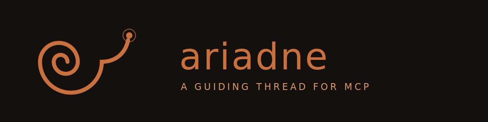

<p align="center">
  
</p>

<p align="center">
  <h1 align="center">ariadne</h1>
  <p align="center">
    <strong>MCP Server for Affected Test Selection</strong>
  </p>
  <p align="center">
    <a href="https://github.com/MikhailHal/ariadne/releases"></a>
    <a href="https://github.com/MikhailHal/homebrew-tap"></a>
    <a href="LICENSE"></a>
    <a href="https://kotlinlang.org"></a>
  </p>
</p>

<br>

**ariadne** is an MCP (Model Context Protocol) server that provides AI agents with the ability to identify affected tests. Powered by [sazanami](https://github.com/MikhailHal/sazanami), it analyzes code changes and returns only the tests that need to be run.

> [!IMPORTANT]
> ## ⚠️ MUST READ: Speed over Completeness
>
> ariadne is built for the agent inner loop — edit, verify, commit — where fast
> feedback matters more than exhaustive selection. Static analysis cannot trace
> every execution path: reflection, DI frameworks, and data-flow indirection
> (e.g., Flux/MVI dispatch) can hide dependencies from **any**
> affected-test-selection tool, not just ariadne.
>
> **Always keep a final line of defense in CI.** Run the full test suite (or a
> conservative selection) before merging. ariadne narrows what an agent runs
> while iterating; it is not a replacement for CI.
>
> When ariadne detects changes it cannot analyze (build scripts, resources,
> unscanned source sets), it says so explicitly in the tool response instead of
> silently reporting "no affected tests".

## Features

- **MCP Integration** — Works with Claude Code, Claude Desktop, and other MCP-compatible clients
- **Automatic Git Diff** — No need to pass diff manually; ariadne runs `git diff` internally
- **Powered by sazanami** — Uses Kotlin Analysis API for accurate static analysis

## Installation

### Homebrew (recommended)

```bash
brew install mikhailhal/tap/ariadne
```

Then register it with your MCP client — for Claude Code:

```bash
claude mcp add ariadne -- ariadne
```

Or add to your MCP client configuration manually (e.g., Claude Desktop):

```json
{
  "mcpServers": {
    "ariadne": {
      "command": "ariadne"
    }
  }
}
```

### Manual (release JAR)

Download `ariadne-<version>-all.jar` from [Releases](https://github.com/MikhailHal/ariadne/releases) (requires JDK 21+) and configure your client with `"command": "java", "args": ["-jar", "/path/to/ariadne-<version>-all.jar"]`.

### Build from Source

```bash
git clone --recursive https://github.com/MikhailHal/ariadne.git
cd ariadne
./gradlew shadowJar   # fat JAR: build/libs/ariadne-<version>-all.jar
```

## Usage

Once configured, AI agents can use the `get_affected_tests` tool:

### Tool: `get_affected_tests`

**Parameters:**
- `project_path` (required) — Path to the Kotlin project
- `base_branch` (optional) — Branch to compare against (default: `origin/main`)

**Returns:**
- List of affected test FQNs (fully qualified names), sorted
- If the diff contains changes outside the analyzed Kotlin sources (build scripts,
  resources, unscanned source sets), a note is appended recommending a full test run
  for those changes
- Analysis is bounded by a 120s timeout; on timeout an explicit error is returned

### Example

Agent request:
```json
{
  "name": "get_affected_tests",
  "arguments": {
    "project_path": "/path/to/your/kotlin/project"
  }
}
```

Response:
```
com.example.UserServiceTest.testCreateUser
com.example.UserRepositoryTest.testSave
```

## How It Works

```
┌─────────────┐     ┌─────────────┐     ┌─────────────┐
│  MCP Client │ ──▶ │   ariadne   │ ──▶ │  sazanami   │
│  (Agent)    │     │ (MCP Server)│     │  (Analysis) │
└─────────────┘     └─────────────┘     └─────────────┘
                           │
                           ▼
                    ┌─────────────┐
                    │  git diff   │
                    └─────────────┘
```

1. **Agent calls tool** — Passes project path to ariadne
2. **Run git diff** — ariadne executes `git diff --unified=0` against base branch
3. **Analyze with sazanami** — Build call graph and find affected tests
4. **Return results** — List of test FQNs returned to agent

## Real-World Validation: Now in Android

Measured against [Now in Android](https://github.com/android/nowinandroid)
(Google's reference Android app — 34 modules, ~268 Kotlin files) with ariadne 0.3.0
(2026-07):

| Metric | Result |
|---|---|
| Recall audit — 19 target functions across all layers | **18/18 valid targets detected** (the 19th had no exercising unit test; correctly not selected) |
| End-to-end response time | **~4s** (module discovery + call-graph build + BFS) |
| Module discovery | 34 modules via `settings.gradle.kts`, incl. nested modules and type-safe accessor dependencies |
| Source sets | `main`, `debug`, `prod`, `benchmark`, `testDemo`, … discovered per module (`androidTest*` excluded by design) |

Verified patterns include repositories behind project interfaces, a library-interface
override (`androidx.datastore.Serializer`), `operator fun invoke` use cases,
`@Composable` functions, extension mappers, ViewModel property-initializer chains,
and callable references. Two representative results:

- Changing `core:common`'s `asResult()` selects **14 tests across three modules**,
  including ViewModel tests reachable only through `val uiState = ...stateIn(...)`
- Changing the mapper `PopulatedNewsResource.asExternalModel()` selects **14 tests**,
  including 11 repository tests reachable only through `.map(Type::mapper)` chains

### Test-class selection rate

Every unit-test class in Now in Android was measured by changing a function in the
class it tests and checking whether that test class was selected:

| Test style | Selected |
|---|---|
| Plain unit tests (construct the object, call it) | 13 / 13 valid targets |
| Robolectric / Compose screenshot tests | **12 / 12** |
| Framework-dispatched callbacks (lint `Detector`) | 0 / 2 — see below |

Robolectric turned out **not** to be a barrier: those tests call the composable
themselves (`setContent { NiaTheme { ... } }`), so the call exists in the source.
What decides coverage is not the test runner but whether the test's own code
contains the call.

### What ariadne cannot see

The rule of thumb: **if the framework calls your code instead of your test calling
it, ariadne cannot connect them.** These are limits of static analysis, not bugs —
plan your CI safety net around them:

| Pattern | Status |
|---|---|
| Framework-invoked callbacks — Fragment/Activity lifecycle (`launchFragmentInContainer`), lint `Detector` methods, `Application.onCreate` | Not traced: no call written in the test |
| Reflection / DI-container wiring | Not traced |
| UDF dispatch (Flux/MVI) | `dispatch → collect` is never an edge, but wiring in `init` (or a `start()` the test calls) is covered conservatively via constructor chains. Subscriptions started by DI/lifecycle are **not** covered ([sazanami#38](https://github.com/MikhailHal/sazanami/issues/38)) |
| `stateIn` / `shareIn` chains (`map`, `onEach`, `flatMapLatest`, `combine`) | Covered — verified with exact selection |
| Instrumented tests (`androidTest*`) | Out of scope by design |
| Build scripts, resources, unscanned source sets | Not analyzed — reported explicitly in the tool response |
| Same-name top-level extensions in one package | Over-selected (receiver types are not part of top-level FQNs) — safe direction |
| KMP source sets (`commonMain`, `expect`/`actual`) | Enumerated, but resolution quality unverified ([#1](https://github.com/MikhailHal/ariadne/issues/1)) |

Full audit notes: [sazanami#29](https://github.com/MikhailHal/sazanami/issues/29),
[sazanami#38](https://github.com/MikhailHal/sazanami/issues/38).

## Requirements

- **JDK 21** or later
- **Git** — For diff detection

## Limitations

- Module discovery is convention-based: it parses `settings.gradle(.kts)` includes,
  enumerates `src/<sourceSet>/{kotlin,java}` layouts, and reads `project(":x")` /
  type-safe accessor dependencies from build files. Dynamic includes,
  `projectDir` remapping, custom `srcDirs`, and dependencies injected by convention
  plugins are not detected — see [#1](https://github.com/MikhailHal/ariadne/issues/1)
- Full graph rebuild on each request (no caching yet); analysis is capped at 120s
- See [What ariadne cannot see](#what-ariadne-cannot-see) for analysis-level gaps

## License

```
Copyright 2025 ariadne contributors

Licensed under the Apache License, Version 2.0 (the "License");
you may not use this file except in compliance with the License.
You may obtain a copy of the License at

    http://www.apache.org/licenses/LICENSE-2.0
```

See [LICENSE](LICENSE) for the full text.
